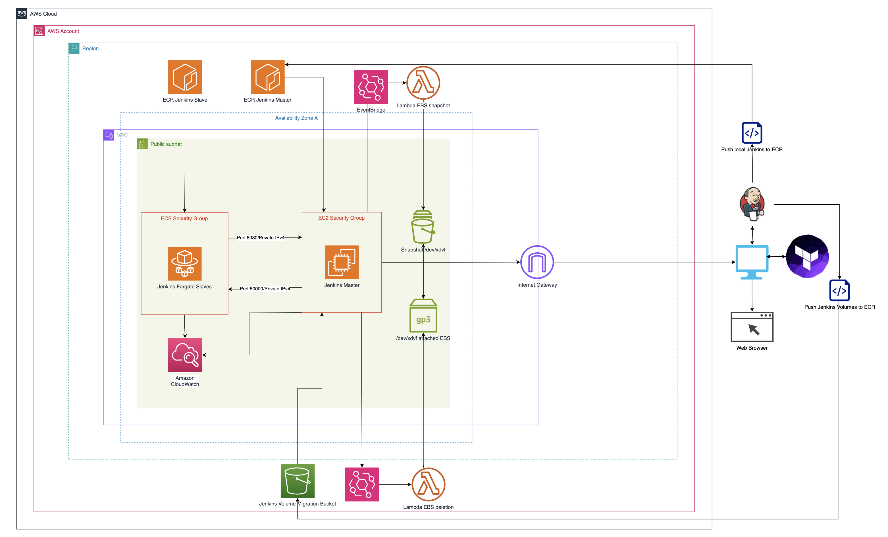
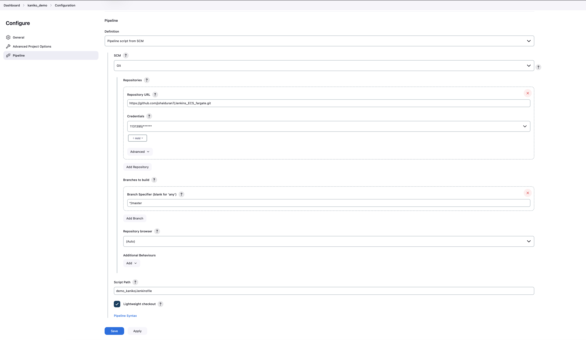
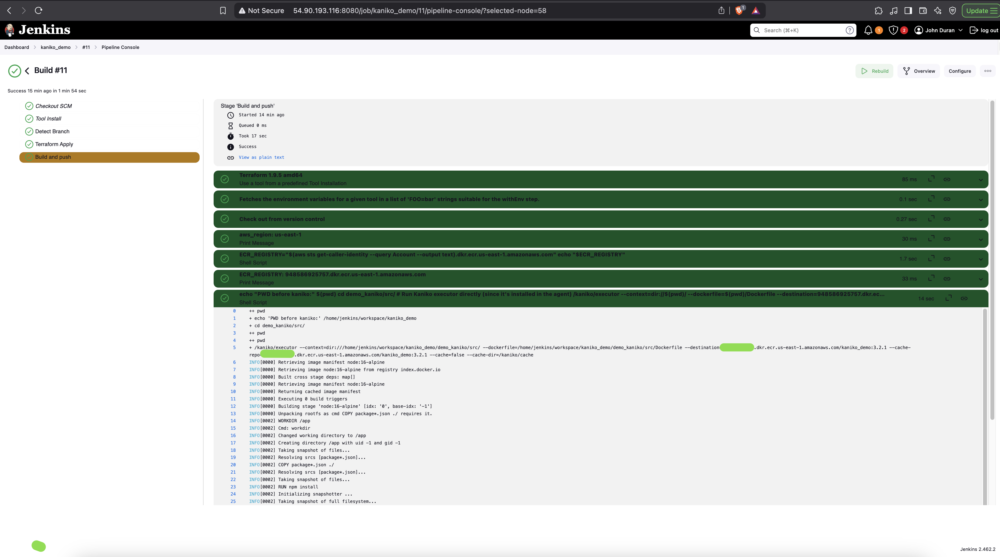

# 🚀 Jenkins EC2 Master & ECS Fargate Slaves with Automated Backup & Kaniko Integration

## 📌 Project Overview
This project provisions a **Jenkins Master on EC2** and **Jenkins Slave Agents on ECS Fargate**, optimizing costs by:
- **Reducing idle instance time** with automated backup of volumes and restore mechanisms.
- **Using Fargate for on-demand Jenkins Slaves**, eliminating always-on EC2 nodes.
- **Implementing Kaniko** for building Docker images without requiring privileged mode (Docker-in-Docker restriction).


## 🎯 Key Features
✅ **Jenkins Master on EC2**
- Runs as a containerized service.
- Backs up and restores automatically from **Amazon EBS**.
- Uses **Amazon ECR** to store the Jenkins image.

✅ **Jenkins Slave Agents on ECS Fargate**
- Runs as Fargate tasks to handle build jobs.
- Uses **Kaniko** for container image builds (avoiding DinD limitations).
- Connects dynamically to Jenkins Master on private network.

✅ **Cost Optimization**
- **EC2 Snapshot Backup**: Automated EBS snapshot creation via **EventBridge & Lambda** before termination.
- **Auto-Restoration**: When a new EC2 instance launches, it restores from the latest snapshot.

✅ **Security & Accessibility**
- **SSM Session Manager**: Secure access to the Jenkins UI.
- Private networking for Fargate tasks with controlled internet access.

## 🔧 Technologies Used
- **AWS Services:** EC2, ECS Fargate, S3, ECR, Lambda, EventBridge, SSM
- **Infrastructure as Code (IaC):** Terraform - backend stored on DynamoDB+S3
- **Configuration Management:** Ansible
- **CI/CD & Containerization:** Jenkins, Kaniko, Docker

## 🚀 Deployment Steps
### Preparation
- Create the backend:
```bash
$ aws s3api create-bucket --bucket jenkins-terraform-backend-john-duran --region 
us-east-1
$ aws s3api put-bucket-versioning --bucket jenkins-terraform-backend-john-duran 
--versioning-configuration Status=Enabled
$ aws dynamodb create-table \
  --table-name jenkins_terraform_backend \
  --attribute-definitions AttributeName=LockID,AttributeType=S \
  --key-schema AttributeName=LockID,KeyType=HASH \
  --billing-mode PAY_PER_REQUEST \
  --region us-east-1
 ## update your terraform backend config:
 	terraform {
	  backend "s3" {
	    bucket         = "jenkins-terraform-backend-john-duran"
	    key            = "terraform/state.tfstate"
	    region         = "us-east-1"
	    dynamodb_table = "jenkins_terraform_backend"
	    encrypt        = true
	  }
	}
```
### 1. Make sure you have Jenkins running locally.
- If you don't have Jenkins runnign locally on docker, follow the steps script/push_jenkins_to_ECR.sh
- Configure your AWS account in the file terraform/modules/ecr/config.json

### 2. Provision Infrastructure
```sh
cd terraform
terraform init
terraform apply -auto-approve
```
### 3. Access Jenkins
- Use **AWS SSM** to connect securely:
```sh
aws ssm start-session --target <instance-id>
```
- Forward Jenkins UI to your local machine:
```sh
ssh -L 8080:localhost:8080 ec2-user@<public-ip>
```
### 4. Backup the local volumes of Jenkins 
If you have your Jenkins running in docker, you can backup the volumes as follows. You can back up the volumes in a similar way. The script backups the volumes and stores them on S3
```sh
bash ./scripts/backup_jenkins_volume.sh
```
### 5. Push the local image of Jenkins to ECR. 
You can build your own docker image for your EC2 master as you wish, then, the following script will push it to ECR.
```sh
bash ./scripts/push_jenkins_to_ECR.sh
```
### 6. Demo Kaniko
I added a pipeline to build a simple image for a NodeJS app and push it to ECR. This is important because AWS Fargate Tasks is serverless, meaning that the underlying infrastructure is managed by AWS so we cannot configure a Docker daemon. Kaniko allows us to build an image without the necessity of a daemon. 
1. Create a pipeline for our Kaniko demo app:
   
3. Run the pipeline:
   
   

## 📌 Future Enhancements
- Automating security mode to deploy VPN and NAT (More expensive option)

